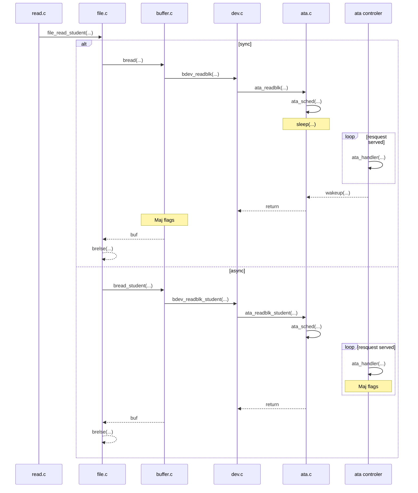

# Compte rendu TP Prefetching
Maxime Chevalier - Ahmed Nassik
*******************************************
Le TP n'est actuellement pas fonctionnel.
Nous avons modifié les fichiers suivant :
- read.c (ligne 89)
- buffer.c
    - bread_Student
    - setValid
- file.c
    - file_read_student 
- dev.c
    - bdev_readblk_student
- ata.c
    - ata_readblk_student
    - ata_handler
- test.c
    - io_test_student
- ramdisk.c
    - modification du RAM disk driver interface
- dev.h
    - modification de la structure bdev
- fs.h
    - ajout des définitions de fonctions

Pour montrer notre compréhention de ce qu'il ce passe, voici un graphique : 

Pour pouvoir test, il faut que le fichier soit déjà sur le disque au démarrage, sinon, si on le créer le fichier sera en cache et les appels à readblk ne seront jamais pris en compte (car les block sont déjà en cache) .

En testant avec les deux méthodes (modification du fichier read.c à la main), on ne voit pas de différences en temps de calcul. Il se peut que les reads soient appelés trop rapidement.

